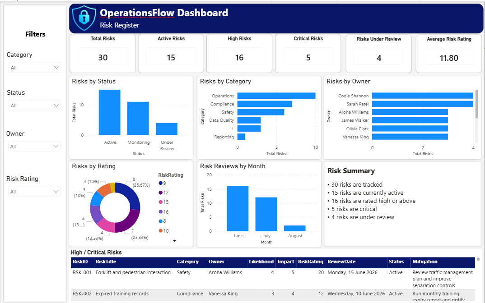

# OperationsFlow Toolkit

OperationsFlow Toolkit is a modular internal business workflow and reporting demo designed to show how common admin, safety, compliance, document control, work order, risk, and follow-up processes can be centralised, tracked, automated, and reported on.

Version 1 started with the **SafetyFlow** module, which demonstrates incident tracking, corrective action management, training/certification expiry tracking, and Power BI dashboard reporting.

The project has since been expanded with:

- Document Control
- Work Orders / Job Tracking
- Risk Register

## Project at a Glance

OperationsFlow Toolkit is a Power BI and Microsoft 365 workflow automation demo that shows how safety, compliance, document control, work orders, and risk tracking can be managed through structured data, dashboards, and planned automation.

Current version: **v1.3**

Completed modules:

- SafetyFlow / Executive Overview
- Corrective Actions
- Training Compliance
- Document Control
- Work Orders
- Risk Register

Planned Microsoft 365 implementation:

- Microsoft Lists / SharePoint Lists backend
- Power Apps forms and registers
- Power Automate reminders and alerts
- Power BI reporting from live list data

## Project Type

This repository is a portfolio proof-of-concept and implementation design package.

The Power BI reporting layer is complete using fake/sample CSV data. The Microsoft 365 semi-live implementation is documented and ready to build once suitable tenant/test-area access is available.

## Current Status

Completed:

- Power BI dashboard proof layer
- Executive Overview dashboard page
- Corrective Actions dashboard page
- Training Compliance dashboard page
- Document Control dashboard page
- Work Orders dashboard page
- Risk Register dashboard page
- Sample CSV datasets
- DAX measures
- Data model documentation
- SharePoint / Microsoft Lists design
- Power Apps screen plan
- Power Automate flow plan
- Deployment plan
- Document Control module documentation
- Work Orders module documentation
- Risk Register module documentation
- GitHub repository package

Pending:

- Microsoft 365 tenant/test area access
- Microsoft Lists / SharePoint Lists deployment
- Power Apps canvas app build
- Power Automate flow build
- Power BI connection to live list data
- Optional Equipment Inspection module build
- Optional Contractor Induction module build

## Key Skills Demonstrated

- Power BI dashboard development
- DAX measures
- CSV data modelling
- Dashboard layout and KPI reporting
- Business process analysis
- Compliance and workflow reporting
- Microsoft Lists / SharePoint list design
- Power Apps screen planning
- Power Automate flow planning
- Documentation and deployment planning
- Modular system design
- Workflow automation planning
- Data-driven business reporting
- Portfolio project packaging

## Business Problem

Many small businesses track safety incidents, corrective actions, training expiry, document reviews, work orders, risks, compliance tasks, and follow-ups across spreadsheets, emails, folders, and manual reminders.

This can lead to:

- missed follow-ups
- overdue corrective actions
- expired training records
- outdated policies or procedures
- unclear document ownership
- overdue work orders
- high risks being missed or forgotten
- unclear risk ownership
- poor visibility over job status
- duplicated admin effort
- slow reporting
- limited management visibility

## Solution

OperationsFlow centralises key records, tracks ownership and due dates, highlights overdue or high-risk work, and provides dashboard reporting for management visibility.

The planned semi-live version extends this by using Microsoft Lists / SharePoint Lists as the backend, Power Apps as the user interface, and Power Automate for reminders and alerts.

## Business Value

This project demonstrates how common spreadsheet-based processes can be turned into a structured internal workflow system.

The dashboards provide visibility over:

- open incidents
- overdue corrective actions
- training expiry
- document reviews
- work order status
- high and critical risks

The planned Microsoft 365 version would reduce manual follow-up by using Power Automate reminders and Power Apps forms connected to Microsoft Lists / SharePoint Lists.

## Current Modules

- Safety Incidents
- Corrective Actions
- Training / Certification Expiry
- Document Control
- Work Orders / Job Tracking
- Risk Register
- Compliance Dashboard
- Semi-live Microsoft 365 implementation plan

## Planned Expansion Modules

- Equipment Inspections
- Contractor Inductions
- PPE / Gear Register
- Monthly Compliance Reporting
- Teams notifications
- PDF/email report generation

## Tools Used

- Power BI Desktop
- CSV sample data
- DAX measures
- Microsoft Lists / SharePoint Lists design
- Power Apps screen plan
- Power Automate flow plan
- GitHub documentation

## How to View the Project

1. Open the screenshots in the `screenshots` folder for a quick visual overview.
2. Read `README.md` for the full project summary.
3. Open `power-bi/OperationsFlow_Dashboard_v1_3.pbix` in Power BI Desktop to view the latest dashboard.
4. Review the `docs` folder for the Microsoft 365 implementation plan.

## Version History

| Version | Description |
|---|---|
| v1 | SafetyFlow dashboard with incidents, corrective actions, and training compliance |
| v1.1 | Added Document Control dashboard module |
| v1.2 | Added Work Orders / Job Tracking dashboard module |
| v1.3 | Added Risk Register dashboard module and final dashboard polish |

## Dashboard Pages

### Executive Overview

Shows high-level safety and compliance status, including open incidents, high-risk incidents, overdue actions, training expiry, and a management summary.

### Corrective Actions

Tracks corrective action status, priority, assigned ownership, overdue work, high-priority work, and completion rate.

### Training Compliance

Tracks training records, valid training, expiring soon records, expired training, compliance rate, and training records requiring attention.

### Document Control

Tracks controlled documents, review dates, document status, document ownership, overdue reviews, and documents requiring attention.

### Work Orders

Tracks operational jobs, job status, due dates, assigned ownership, overdue work, priority, estimated/actual hours, and workload reporting.

### Risk Register

Tracks business risks, risk ratings, risk ownership, review dates, active risks, high-rated risks, critical risks, and risks under review.

## Screenshots

### Executive Overview


### Corrective Actions


### Training Compliance


### Document Control


### Work Orders


### Risk Register



## Sample Data

Sample CSV data is stored in the `sample-data` folder:

- `Safety_Incidents.csv`
- `Corrective_Actions.csv`
- `Training_Expiry.csv`
- `Document_Control.csv`
- `Work_Orders.csv`
- `Risk_Register.csv`

## Data Note

All data used in this project is fake/sample data created for demonstration purposes only. No real business, client, employee, or safety data is included.

## Power BI Files

The Power BI report files are stored in the `power-bi` folder:

- `OperationsFlow_Dashboard_v1.pbix`
- `OperationsFlow_Dashboard_v1_1.pbix`
- `OperationsFlow_Dashboard_v1_2.pbix`
- `OperationsFlow_Dashboard_v1_3.pbix`

Version meaning:

- `v1` = SafetyFlow base dashboard
- `v1_1` = Document Control module added
- `v1_2` = Work Orders module added
- `v1_3` = Risk Register module added

## Documentation

Supporting documentation is stored in the `docs` folder:

- `project-summary.md`
- `data-model.md`
- `sharepoint-list-design.md`
- `power-apps-screen-plan.md`
- `power-automate-flows.md`
- `deployment-plan.md`
- `future-module-document-control.md`
- `future-module-work-orders.md`
- `future-module-risk-register.md`

## Current Workflow

Incident logged  
→ risk level assigned  
→ corrective action created  
→ owner and due date tracked  
→ overdue / high-risk items identified  
→ dashboard updates with current status

## Planned Semi-Live Workflow

Incident submitted through Power Apps  
→ record saved to Microsoft Lists / SharePoint Lists  
→ high-risk incident alert triggered through Power Automate  
→ corrective actions tracked by owner and due date  
→ overdue reminders sent automatically  
→ Power BI reports from live list data

## Document Control Expansion

The Document Control module helps businesses track policies, procedures, forms, registers, templates, and other controlled documents so review dates, version updates, ownership, and document status are easier to manage.

The planned Document Control workflow is:

Document created  
→ owner assigned  
→ review date set  
→ status tracked  
→ reminders sent when review is due or overdue  
→ dashboard provides visibility

The module tracks:

- document name
- document ID
- document type
- department
- owner
- version
- status
- last reviewed date
- next review date
- days until review
- document link
- notes

The full design is documented in:

- `docs/future-module-document-control.md`

## Work Orders Expansion

The Work Orders module helps businesses track operational jobs, service tasks, internal work, support requests, and follow-up work.

The planned Work Orders workflow is:

Job created  
→ owner assigned  
→ due date set  
→ priority assigned  
→ status tracked  
→ overdue work highlighted  
→ dashboard provides visibility

The module tracks:

- job ID
- job name
- client
- site
- job type
- status
- created date
- due date
- completed date
- assigned person
- priority
- estimated hours
- actual hours
- notes

The full design is documented in:

- `docs/future-module-work-orders.md`

## Risk Register Expansion

The Risk Register module helps businesses identify, track, review, and report risks across safety, compliance, operations, IT, reporting, and data quality areas.

The planned Risk Register workflow is:

Risk identified  
→ likelihood and impact assessed  
→ risk rating calculated  
→ owner assigned  
→ mitigation recorded  
→ review date set  
→ dashboard provides visibility

The module tracks:

- risk ID
- risk title
- category
- likelihood
- impact
- risk rating
- owner
- review date
- status
- mitigation
- notes

The full design is documented in:

- `docs/future-module-risk-register.md`

## Microsoft 365 Implementation Plan

The planned semi-live implementation would use:

### Microsoft Lists / SharePoint Lists

Used as the backend for structured records:

- Safety Incidents
- Corrective Actions
- Training Expiry
- Document Control
- Work Orders
- Risk Register

### Power Apps

Used as the front-end for creating, editing, and reviewing records.

Planned app screens include:

- Home
- New Incident
- Incident Register
- Corrective Actions
- Training Expiry
- Document Register
- Work Order Register
- Risk Register

### Power Automate

Used for reminders and alerts.

Planned flows include:

- high-risk incident alerts
- overdue corrective action reminders
- training expiry reminders
- document review reminders
- overdue work order reminders
- risk review reminders
- critical risk alerts

### Power BI

Used for dashboards and management reporting connected to the live list data.

## Why This Project Matters

This project demonstrates how manual spreadsheet-based processes can be turned into structured business workflows.

The dashboard layer gives management visibility over open incidents, overdue corrective actions, training compliance, document reviews, work order status, and business risks.

The planned Microsoft 365 semi-live version would allow users to submit and update records through Power Apps, store them in Microsoft Lists / SharePoint Lists, trigger reminders through Power Automate, and report on live data through Power BI.

The same workflow pattern can be reused across other business areas, including document control, risk management, equipment checks, contractor onboarding, job tracking, and monthly reporting.

## Future Improvements

Future versions could include:

- Microsoft Lists / SharePoint Lists deployment
- Power Apps incident submission form
- Power Apps corrective action tracker
- Power Apps work order register
- Power Apps document review register
- Power Apps risk register form
- Power Automate high-risk incident alerts
- Power Automate overdue action reminders
- Power Automate training expiry reminders
- Power Automate document review reminders
- Power Automate overdue work order reminders
- Power Automate risk review reminders
- Power Automate critical risk alerts
- Power BI connection to live Microsoft Lists / SharePoint data
- Equipment Inspection module
- Contractor Induction module
- Teams notifications
- PDF/email reporting
- role-based views
- manager-specific dashboards

## Repository Structure

```text
OperationsFlow-Toolkit
├── README.md
├── docs
│   ├── project-summary.md
│   ├── data-model.md
│   ├── sharepoint-list-design.md
│   ├── power-apps-screen-plan.md
│   ├── power-automate-flows.md
│   ├── deployment-plan.md
│   ├── future-module-document-control.md
│   ├── future-module-work-orders.md
│   └── future-module-risk-register.md
├── sample-data
│   ├── Safety_Incidents.csv
│   ├── Corrective_Actions.csv
│   ├── Training_Expiry.csv
│   ├── Document_Control.csv
│   ├── Work_Orders.csv
│   └── Risk_Register.csv
├── screenshots
│   ├── OperationsFlow_SafetyFlow_ExecutiveOverview_v1.png
│   ├── OperationsFlow_SafetyFlow_CorrectiveActions_v1.png
│   ├── OperationsFlow_SafetyFlow_TrainingCompliance_v1.png
│   ├── OperationsFlow_DocumentControl_v1.png
│   ├── OperationsFlow_WorkOrders_v1.png
│   └── OperationsFlow_RiskRegister_v1.png
└── power-bi
    ├── OperationsFlow_Dashboard_v1.pbix
    ├── OperationsFlow_Dashboard_v1_1.pbix
    ├── OperationsFlow_Dashboard_v1_2.pbix
    └── OperationsFlow_Dashboard_v1_3.pbix